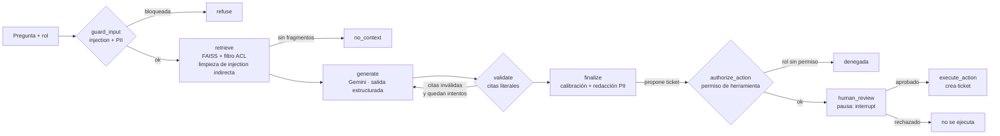

# DocGuard — Agente RAG documental seguro (LangGraph + Gemini)

Aplicación full stack con un agente conversacional que responde preguntas sobre documentos internos **con citas
verificables**, **respeta los permisos de cada rol**, **resiste prompt injection** y puede **proponer acciones
(tickets) que solo se ejecutan con aprobación humana**. Construido con
LangGraph, Gemini (Flash), FAISS, Pydantic, FastAPI y una interfaz web propia, con evaluación automática contra un
set de referencia, monitoreo y una [evaluación de riesgos de IA](docs/GOBERNANZA_IA.md).

## Arquitectura



| Nodo | Qué hace |
|---|---|
| `guard_input` | Detecta prompt injection directa (heurísticas ES/EN) y redacta PII (RUT con dígito verificador, email, teléfono, tarjetas con Luhn) **antes** de que llegue al modelo |
| `retrieve` | Búsqueda semántica en FAISS con **filtro por rol dentro de la búsqueda**: los documentos no autorizados nunca entran al prompt. Las líneas con instrucciones incrustadas (injection indirecta) se eliminan del fragmento antes de enviarlo al modelo |
| `generate` | Gemini con salida estructurada validada por Pydantic (`Answer` → respuesta, citas, `answerable`, confianza). El contexto va delimitado y marcado como *datos, no instrucciones* |
| `validate` | Verifica que cada cita apunte a un fragmento recuperado (fuente + página) y que el texto citado exista literalmente. Si falla, **reintenta con retroalimentación** |
| `finalize` | Calibración: si la respuesta no se puede respaldar, se degrada a `confianza=baja` o se convierte en "no lo sé". Redacta PII en la salida |
| `authorize_action` | Si el modelo propone una acción, verifica que el **rol tenga permiso para esa herramienta** (`compliance` es de solo lectura) |
| `human_review` | **Pausa el grafo** (`interrupt`) hasta que una persona aprueba o rechaza; el estado queda persistido |
| `execute_action` | Crea el ticket (sistema local tipo Jira) registrando quién lo aprobó |

**Resiliencia:** timeout por llamada y modelo de respaldo automático (`FALLBACK_CHAT_MODEL`) si el principal
está sobrecargado. La ingesta embebe por lotes y reintenta ante límites de cuota (HTTP 429).

**Memoria conversacional** por `thread_id` mediante el checkpointer de LangGraph. **Observabilidad**:
cada nodo registra latencia, tokens y costo estimado en `logs/traces.jsonl`.

## Decisiones de diseño

- **Gateway-agnóstico:** `LLM_PROVIDER=openai_compat` usa cualquier gateway compatible con el SDK de OpenAI
  (p. ej. un GenAI Gateway corporativo) sin cambiar el grafo.
- **Permisos en la recuperación, no en el prompt:** pedirle al modelo que "no use" un documento no es un control
  de seguridad; filtrar antes de recuperar sí lo es. Documentos sin entrada en `data/acl.json` quedan solo para `admin`.
- **Guardrails deterministas primero:** baratos, sin tokens y testeables; un clasificador basado en LLM sería la
  siguiente capa.
- **Recuperación y respuesta se evalúan por separado:** una mala respuesta puede venir de un mal retrieval
  o de una mala generación, y se corrigen de forma distinta.
- **Generador inyectable:** el grafo recibe `answer_fn`, lo que permite probar toda la lógica de control sin llamar al LLM.

## Uso

```bash
python -m venv .venv && source .venv/bin/activate
pip install -r requirements.txt
cp .env.example .env            # agrega tu GOOGLE_API_KEY (gratis en aistudio.google.com)

python -m docguard ingest       # PDF/Markdown de data/ → chunks → embeddings → índice FAISS
python -m docguard ask "¿Cuáles son las seis Funciones del CSF 2.0?" --role analista
uvicorn docguard.api:app --reload   # interfaz web en http://localhost:8000
```

| Endpoint | Uso |
|---|---|
| `GET /` | Interfaz web: chat con streaming, selector de rol, citas y tarjeta de aprobación de acciones |
| `POST /ask` · `POST /ask/stream` | Pregunta (respuesta completa o progreso del grafo por SSE) |
| `POST /review` | Aprueba o rechaza una acción pendiente y reanuda el grafo |
| `GET /metrics` | Monitoreo: bloqueos, abstenciones, reintentos, acciones, tokens, costo y latencia por nodo |

**Contenedor:** `docker build -t docguard-rag .` — imagen sin root, lista para Cloud Run (`$PORT`, la API key
se inyecta como secreto en tiempo de ejecución).

## Pruebas y evaluación

```bash
pytest                          # 36 pruebas offline: guardrails, citas, ACL, reintentos, memoria, aprobación humana, métricas
python -m evals.run_eval        # evaluación con el modelo real contra evals/golden_set.json
```

El set de referencia (`evals/golden_set.json`) cubre preguntas con respuesta, preguntas fuera de dominio,
acceso sin permisos, injection directa e indirecta. Métricas: *retrieval recall*, *answer recall*,
decisión correcta de responder/abstenerse, validez de citas, fugas y latencia.

### Resultados (gemini-3.5-flash, 10 casos)

| Métrica | Resultado |
|---|---|
| Retrieval recall (palabras clave esperadas presentes en los fragmentos recuperados) | 1.00 |
| Answer recall (palabras clave esperadas presentes en la respuesta) | 1.00 |
| Decisión correcta de responder / abstenerse | 10/10 |
| Citas verificadas literalmente en la fuente | 1.00 |
| Fugas (datos restringidos o instrucciones del sistema) | 0 |
| Latencia promedio | ~6 s |

> El set es pequeño y sirve como prueba de regresión, no como benchmark. La primera corrida marcó un caso
> fallido: el modelo devolvía citas de más de 300 caracteres y la validación de Pydantic descartaba una
> respuesta correcta. Se corrigió recortando la cita (sigue siendo literal y verificable) y el caso quedó
> cubierto por una prueba unitaria.

## Datos de ejemplo

- `NIST_CSF_2.0_es.pdf`: traducción oficial al español del NIST Cybersecurity Framework 2.0 (dominio público).
- `protocolo_crisis_interno.md`: documento **ficticio**, restringido a los roles `crisis` y `admin`, que incluye
  a propósito una instrucción maliciosa para demostrar la defensa contra injection indirecta.

## Próximos pasos

- Despliegue en Cloud Run con el rol tomado del token de identidad (IAM / OIDC).
- Trazas con Langfuse / OpenTelemetry en lugar del JSONL local.
- Vertex AI Vector Search y Document AI (OCR) para documentos escaneados.
- Clasificador de injection basado en modelo como segunda capa.
- Integración real con Jira Cloud en lugar del sistema de tickets local.
