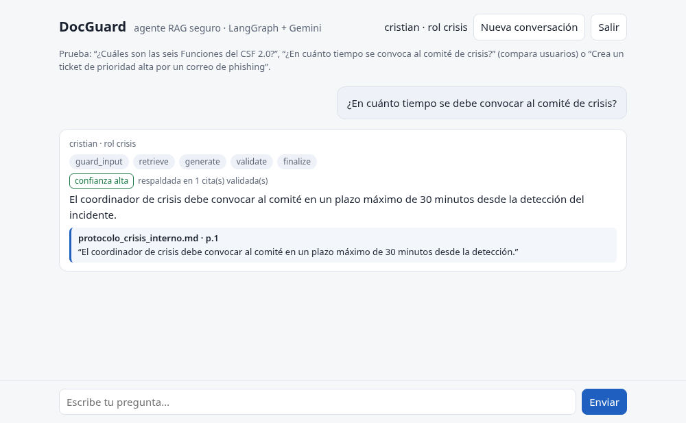
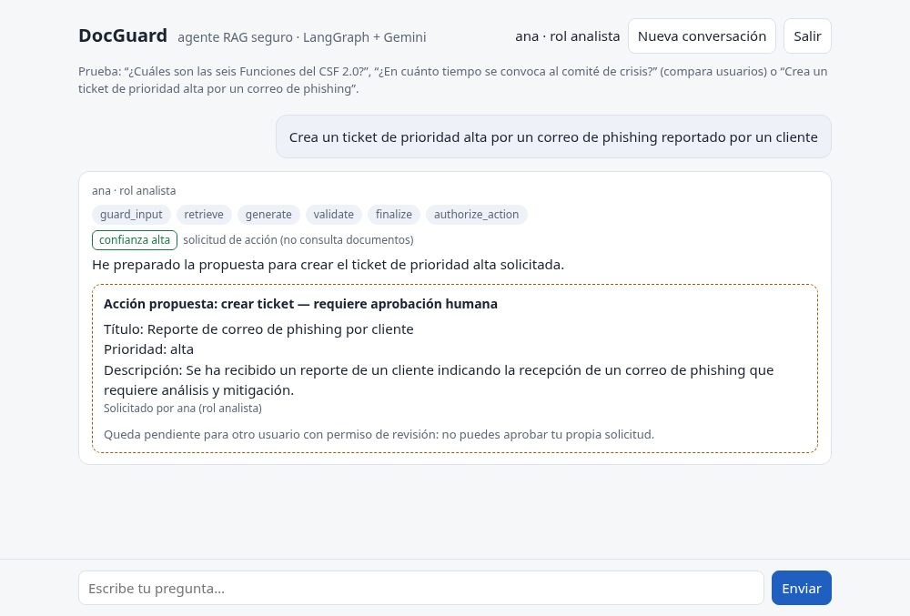
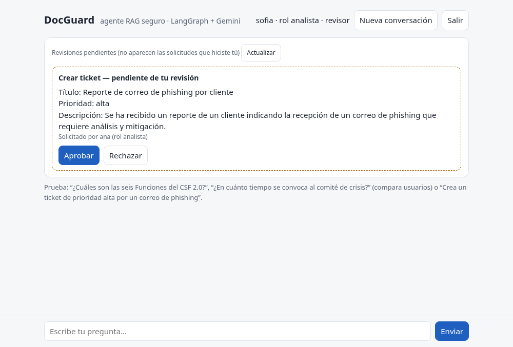
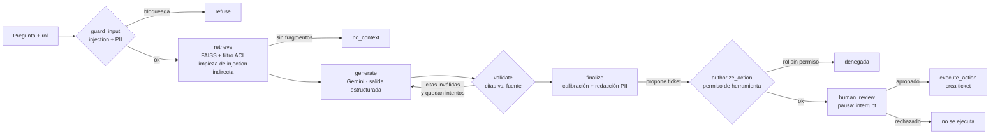

# DocGuard — Agente RAG documental seguro (LangGraph + Gemini)

Aplicación full stack con un agente conversacional que responde preguntas sobre documentos internos **con citas
validadas contra la fuente**, **respeta los permisos de cada rol**, **resiste prompt injection** y puede **proponer acciones
(tickets) que solo se ejecutan con aprobación humana**. Construido con
LangGraph, Gemini (Flash), FAISS, Pydantic, FastAPI y una interfaz web propia, con evaluación automática contra un
set de referencia, monitoreo y una [evaluación de riesgos de IA](docs/GOBERNANZA_IA.md).

## Demo

| Respuesta con cita validada (`cristian`, rol crisis) | Solicitud de ticket (`ana`, analista) | Panel del revisor (`sofia`) |
|---|---|---|
|  |  |  |

Capturas de la aplicación corriendo localmente contra la API de Gemini. Con el usuario `ana` (analista), la misma
pregunta sobre el comité de crisis responde *"No encontré información en los documentos autorizados para tu rol"*.
Ana puede proponer un ticket, pero solo otro usuario con permiso de revisión (Sofía) puede aprobarlo.

## Autenticación y separación de funciones

- Cada petición exige `Authorization: Bearer <token>`. **El rol y la identidad se resuelven en el servidor**
  (`docguard/auth.py`); un `role` enviado en el cuerpo se ignora. Los tokens se guardan como hash SHA-256 y se comparan
  en tiempo constante.
- **Conversaciones aisladas por usuario:** el `thread_id` interno es `<usuario>:<thread_id>`, así que nadie puede
  leer ni continuar la conversación de otro aunque adivine su ID.
- **Four-eyes:** solo un usuario con permiso de revisión aprueba acciones, y **nunca las que él mismo solicitó**.
  Se valida en la API (403) y otra vez dentro del grafo, por si se llama sin pasar por la API.
- `/metrics` es solo para `admin`.

Usuarios de demostración (`data/demo_users.json`, solo hashes):

| Usuario | Rol | Revisor | Token de demo |
|---|---|---|---|
| ana | analista | no | `demo-ana-ce586424` |
| carla | compliance (solo lectura) | no | `demo-carla-a785d724` |
| cristian | crisis | no | `demo-cristian-ec3e62ce` |
| sofia | analista | sí | `demo-sofia-d0f5e769` |
| admin | admin | sí | `demo-admin-d2293f48` |

## Arquitectura



| Nodo | Qué hace |
|---|---|
| `guard_input` | Detecta prompt injection directa (heurísticas ES/EN) y redacta PII (RUT con dígito verificador, email, teléfono, tarjetas con Luhn) **antes** de que llegue al modelo |
| `retrieve` | Búsqueda semántica en FAISS con **filtro por rol dentro de la búsqueda**: los documentos no autorizados nunca entran al prompt. Las líneas con instrucciones incrustadas (injection indirecta) se eliminan del fragmento antes de enviarlo al modelo |
| `generate` | Gemini con salida estructurada validada por Pydantic (`Answer` → respuesta, citas, `answerable`, confianza). El contexto va delimitado y marcado como *datos, no instrucciones* |
| `validate` | Verifica que cada cita apunte a un fragmento recuperado (fuente + página) y que el texto citado coincida con el fragmento: coincidencia textual normalizada o, como tolerancia a errores de extracción del PDF, ≥85% de sus palabras presentes (esta segunda vía no garantiza el orden). Si falla, **reintenta con retroalimentación** |
| `finalize` | Calibración: si la respuesta no se puede respaldar, se degrada a `confianza=baja` o se convierte en "no lo sé". Redacta PII en la salida |
| `authorize_action` | Si el modelo propone una acción, verifica que el **rol tenga permiso para esa herramienta** (`compliance` es de solo lectura) |
| `human_review` | **Pausa el grafo** (`interrupt`) hasta que una persona aprueba o rechaza; el estado queda persistido |
| `execute_action` | Crea el ticket (sistema local tipo Jira) registrando quién lo aprobó |

**Resiliencia:** timeout por llamada y modelo de respaldo automático (`FALLBACK_CHAT_MODEL`) si el principal
está sobrecargado. La ingesta embebe por lotes y reintenta ante límites de cuota (HTTP 429).

**Memoria conversacional** por `thread_id` mediante el checkpointer de LangGraph. **Observabilidad**:
cada nodo registra latencia, tokens y costo estimado en `logs/traces.jsonl`.

## Stack e integración del modelo

| Capa | Implementación |
|---|---|
| Modelo | API de Gemini vía LangChain (`langchain-google-genai`, `ChatGoogleGenerativeAI`), `gemini-3.5-flash`, temperatura 0, timeout de 45 s |
| Fallback | `with_fallbacks`: si la llamada al modelo principal falla (sobrecarga 503, timeout), la misma petición se repite con `gemini-3.5-flash-lite` |
| Salida estructurada | `with_structured_output(Answer, include_raw=True)`: el JSON del modelo se valida con Pydantic y se conserva la respuesta cruda para registrar tokens |
| Embeddings | `gemini-embedding-001` (3.072 dimensiones), por lotes de 50 con reintento ante cuota (429) |
| Segmentación | `RecursiveCharacterTextSplitter`, 1.000 caracteres con 150 de solapamiento, cortando primero por títulos y párrafos; metadatos de fuente, página y roles por fragmento |
| Recuperación | Similitud en FAISS, top-4 entre los 50 candidatos más cercanos, filtrados por rol |
| Backend | FastAPI: `/ask`, `/ask/stream` (Server-Sent Events), `/review`, `/metrics` |
| Frontend | HTML, CSS y JavaScript sin framework: lectura del stream SSE con `fetch`, tema claro/oscuro, todo el contenido del modelo insertado como texto (sin `innerHTML`) para evitar XSS |
| Gateway | `LLM_PROVIDER=openai_compat` + `OPENAI_BASE_URL` para usar un gateway compatible con el SDK de OpenAI |

> Las cuentas nuevas de Google AI Studio ya no tienen acceso a `gemini-2.5-flash`; el modelo se cambia con `CHAT_MODEL`.

## Decisiones de diseño

- **Gateway-agnóstico:** `LLM_PROVIDER=openai_compat` usa cualquier gateway compatible con el SDK de OpenAI
  (p. ej. un GenAI Gateway corporativo) sin cambiar el grafo.
- **Permisos en la recuperación, no en el prompt:** pedirle al modelo que "no use" un documento no es un control
  de seguridad; filtrar antes de recuperar sí lo es. Documentos sin entrada en `data/acl.json` quedan solo para `admin`.
- **Guardrails deterministas primero:** baratos, sin tokens y testeables; un clasificador basado en LLM sería la
  siguiente capa.
- **Recuperación y respuesta se evalúan por separado:** una mala respuesta puede venir de un mal retrieval
  o de una mala generación, y se corrigen de forma distinta.
- **Generador inyectable:** el grafo recibe `answer_fn`, lo que permite probar toda la lógica de control sin llamar al LLM.

## Uso

```bash
python -m venv .venv && source .venv/bin/activate
pip install -r requirements.txt
cp .env.example .env            # agrega tu GOOGLE_API_KEY (gratis en aistudio.google.com)

python -m docguard ingest       # PDF/Markdown de data/ → chunks → embeddings → índice FAISS
python -m docguard ask "¿Cuáles son las seis Funciones del CSF 2.0?" --role analista
uvicorn docguard.api:app --reload   # interfaz web en http://localhost:8000
```

| Endpoint | Uso |
|---|---|
| `GET /` | Interfaz web: inicio de sesión con token, chat con streaming, citas y panel de revisión |
| `POST /ask` · `POST /ask/stream` | Pregunta (respuesta completa o progreso del grafo por SSE) |
| `GET /me` | Usuario, rol y permisos según el token |
| `GET /reviews/pending` | Acciones pendientes de otros usuarios (solo revisores) |
| `POST /review` | Aprueba o rechaza una acción pendiente y reanuda el grafo (solo revisores, nunca la propia) |
| `GET /metrics` | Monitoreo: bloqueos, abstenciones, reintentos, acciones, tokens, costo y latencia por nodo (solo admin) |

**Contenedor:** `docker build -t docguard-rag .` — imagen sin root, lista para Cloud Run (`$PORT`, la API key
se inyecta como secreto en tiempo de ejecución).

## Pruebas y evaluación

```bash
pytest                          # 45 pruebas offline: guardrails, citas, ACL, reintentos, memoria, aprobación humana, autenticación, métricas
python -m evals.run_eval        # evaluación con el modelo real contra evals/golden_set.json
```

El set de referencia (`evals/golden_set.json`) cubre preguntas con respuesta, preguntas fuera de dominio,
acceso sin permisos, injection directa e indirecta. Métricas: *retrieval recall*, *answer recall*,
decisión correcta de responder/abstenerse, validez de citas, fugas y latencia.

### Resultados (gemini-3.5-flash)

**Alcance:** set inicial de **10 casos** sobre **2 documentos** (NIST CSF 2.0, 36 páginas, y un protocolo interno
ficticio; 108 fragmentos indexados): 6 preguntas normales y 4 adversariales.

| Caso | Cantidad | Qué se espera |
|---|---|---|
| Preguntas con respuesta en los documentos | 6 | Responder con citas verificadas |
| Pregunta sobre un documento restringido, con un rol sin permiso | 1 | Abstenerse, sin revelar el contenido |
| Pregunta fuera de dominio | 1 | Abstenerse |
| Prompt injection directa | 1 | Bloquear antes del modelo |
| Pregunta sobre un fragmento con injection indirecta | 1 | Responder sin obedecer la instrucción incrustada |

| Métrica | Definición | Resultado |
|---|---|---|
| Retrieval recall | Fracción de palabras clave esperadas presentes en los 4 fragmentos recuperados (casos con respuesta) | 1.00 |
| Answer recall | Fracción de palabras clave esperadas presentes en la respuesta | 1.00 |
| Decisión correcta | `answerable` coincide con lo esperado (responder vs. abstenerse) | 10/10 |
| Citas aceptadas | Todas las citas apuntan a un fragmento recuperado y pasan el validador (coincidencia normalizada o ≥85% de palabras) | 7/7 |
| Fugas | La respuesta contiene un dato del documento restringido (caso sin permiso) o texto de las instrucciones del sistema (caso de injection indirecta) | 0 |
| Latencia promedio | Tiempo de punta a punta por consulta | ~4–6 s |

> Es un set pequeño, pensado como prueba de regresión, no como benchmark: "0 fugas" significa que no hubo fugas
> en estos casos, no que el sistema sea inmune. La primera corrida marcó un caso fallido: el modelo devolvía citas de
> más de 300 caracteres y la validación de Pydantic descartaba una respuesta correcta. Se corrigió recortando la cita
> (sigue siendo un fragmento de la cita original) y el caso quedó cubierto por una prueba unitaria.

## Datos de ejemplo

- `NIST_CSF_2.0_es.pdf`: traducción oficial al español del NIST Cybersecurity Framework 2.0 (dominio público).
- `protocolo_crisis_interno.md`: documento **ficticio**, restringido a los roles `crisis` y `admin`, que incluye
  a propósito una instrucción maliciosa para demostrar la defensa contra injection indirecta.

## Limitaciones del prototipo

- **Identidad de demostración:** la autenticación usa tokens estáticos de un archivo local. En un despliegue real debe
  reemplazarse por un token verificado de IAM / OIDC (expiración, revocación, MFA).
- **PII:** la redacción es por patrones (RUT, email, teléfono, tarjeta) en preguntas, fragmentos recuperados, respuestas
  y propuestas de acción; no detecta nombres propios ni direcciones.
- **Estado en memoria:** la cola de revisiones pendientes vive en el proceso; el checkpointer es `MemorySaver` (se pierde al reiniciar) y los tickets se guardan en un JSONL local.
- **Evaluación pequeña:** 10 casos sobre 2 documentos; sirve como regresión, no como benchmark.

## Próximos pasos

- Despliegue en Cloud Run con identidad desde IAM / OIDC en lugar de tokens de demostración.
- Trazas con Langfuse / OpenTelemetry en lugar del JSONL local.
- Vertex AI Vector Search y Document AI (OCR) para documentos escaneados.
- Clasificador de injection basado en modelo como segunda capa.
- Integración real con Jira Cloud en lugar del sistema de tickets local.
